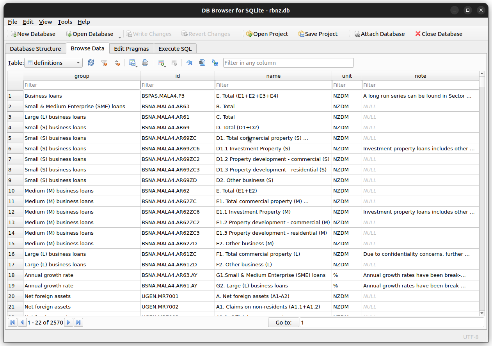
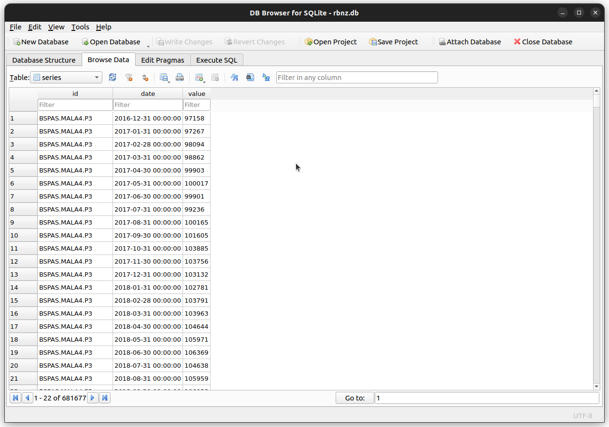

# Fetch Time Series Data from RBNZ Website

**NOTE**: I previously created a [repository](https://github.com/cmhh/rbnz) which included a Scala program that did the same thing as this repo, and also included a little data service that could be used to serve the result.  For various reasons, I needed to do something very similar using Python, so thought I'd post the code.  I do not particularly like Python, am not particularly adept at it, and I doubt this code will present as very _Pythonistic_.  But I appreciate that anybody looking at this will likely prefer Python code over Scala code, so here it is...

Data on the [Reserve Bank of New Zealand](https://www.rbnz.govt.nz/statistics) website can be a little awkward to source and use, painfully so for those who wish to automate the process.  First, all data is stored in Excel spreasheets which aren't directly machine readable.  But even then, the data isn't easily used because the files themselves, due to the way they're hosted, cannot be directly downloaded in tools such as R or Python, or common clients such as `curl` and `wget`.  For example, the following R command will fail outright:

```r
download.file(
  "https://www.rbnz.govt.nz/-/media/project/sites/rbnz/files/statistics/series/b/b1/hb1-daily.xlsx",
  "hb1-daily.xlsx"
)
```

On top of this, these files are also subject to some pretty severe [terms of use](https://www.rbnz.govt.nz/about-our-site/terms-of-use).  Users are required to get written permission for any automation, and even then must not perform more than 1 GET per minute!  There are 115 files listed on the website, totalling 8MB all up.  **These terms mean users are required to take 2 hours to download 8MB of data**!  The Reserve Bank could simplify things for their users considerably simply by placing all these files in a single zip file and making it available via a single stable link that could be fetched via common clients such as wget and cURL... Azure BLOB storage, and S3 bucket... anything, really.  But in lieu of that...

This repo includes a simple Python script which can be used to fetch all Excel files listed on the [Statistical series data files page](https://www.rbnz.govt.nz/statistics/series/data-file-index-page), compile the data, and save to a SQLite database.  Simply run something like:

```bash
python scrape.py rbnz.db
```

Excel files will successfully import if they:

* have a tab named `Data`
* have a tab named `Series Definitions`
* data in `Data` tab must start in row 6, with series IDs in row 5
* `Series Definitions` tab must have 5 columns with header row.

Note that there is a single series which has a non-numeric value, `EXRT.YS45.ZZB17`, which is date-valued.  Rather than create a database schema that can handle multiple types, I just dropped this one series.  


## Selenium / Chrome / Chromedriver

The program uses Selenium webdriver, and assumes Chrome and [chromedriver](https://chromedriver.chromium.org/) are available, and working correctly.  One easy way to ensure this is the case is to use Docker, and a sufficient `Dockerfile` is provided.


## Using the Scripts with Docker

Users first need to build the docker image:

```bash
docker build -t rbnz:python .
```

To create a database:

```bash
docker run --rm \
  -v $PWD:/data \
  -u $(id -u):$(id -g) \
  rbnz:python \
  /data/rbnz.db
```

The end result will look something like this:




